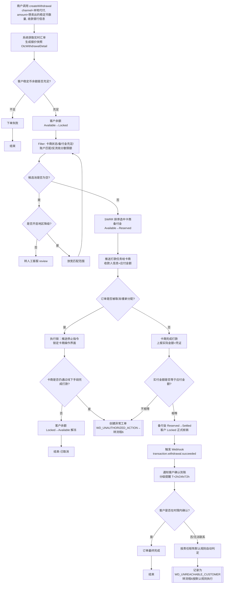
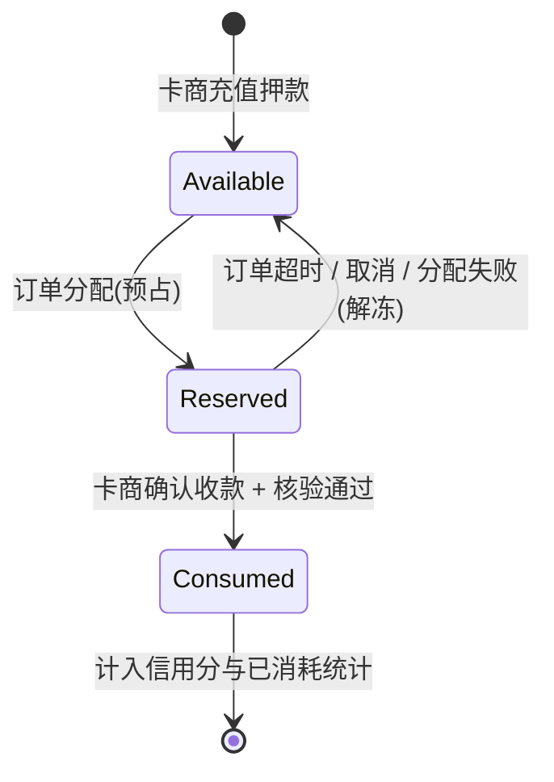
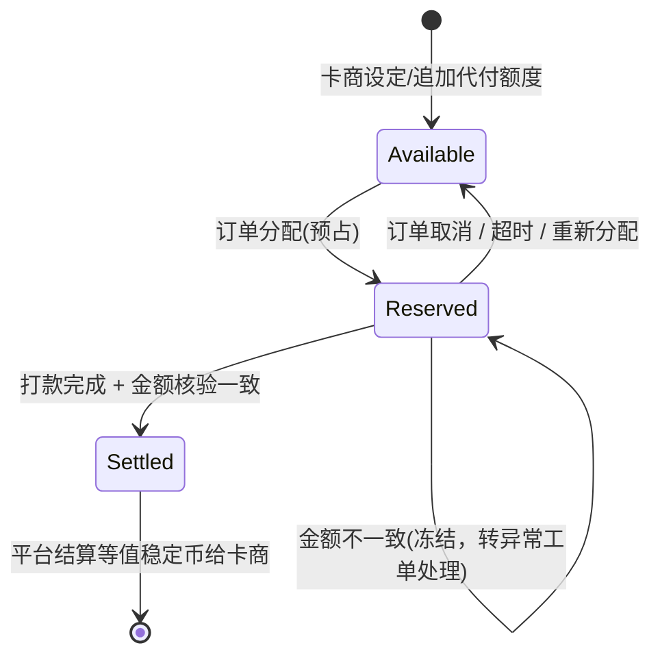
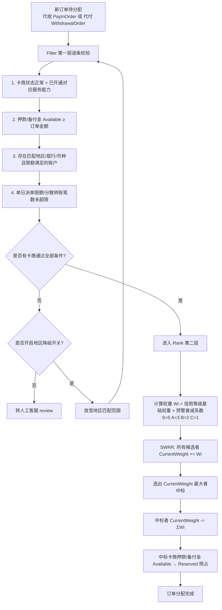

# PayPaz 卡商本地 Onramp / Offramp — 功能清单与业务流程图

基于设计文档 v0.3（卡商作为现有稳定币支付体系的新渠道）整理。先看功能清单和流程清单，再看每个流程的完整图。

---

## 一、功能清单

### 商户端（Broker 后台）

| 功能名称 | 关联客户端 | 定义与作用 |
|---|---|---|
| 本地代收下单 | 商户端 | 复用现有 `createPayInOrder` 接口，新增 `channel=本地代收` 参数；客户输入想买入的稳定币数量，系统按实时汇率计算法币金额并展示分配到的卡商收款信息 |
| 本地代付下单 | 商户端 | 复用现有 `createWithdrawal` 接口，新增 `channel=本地代付` 参数与客户收款银行信息；客户卖出稳定币换回法币 |
| 汇率报价与锁价展示 | 商户端 | 下单后展示本次锁定的汇率、应付/应收法币金额、锁价倒计时 |
| 订单追踪（渠道筛选） | 商户端 | 现有"资产 &gt; 历史记录 &gt; 订单"页新增渠道列（链上/本地代收/本地代付），可查看状态与进度 |
| 关联稳定币充值记录查看 | 商户端 | 现有"资产 &gt; 历史记录 &gt; 充值"页可直接查到卡商确认到账后生成的充值记录，并可从订单详情跳转关联 |

### 卡商端（代收方向）

| 功能名称 | 关联客户端 | 定义与作用 |
|---|---|---|
| 押款账本（可用/冻结中/已消耗） | 卡商端（管理端可查看） | 代收方向的稳定币押款三态余额，Available 是派单资格的硬性门槛 |
| 支付方式合规预检 | 卡商端 | 标记"已收款"前强制选择支付渠道，命中禁用渠道直接拦截 |
| 疑似代付识别 | 卡商端 | 核对收款凭证付款人信息与订单预留客户信息，不一致则阻断自动完成 |
| 凭证防伪校验 | 卡商端 | 上传的收款凭证经鉴伪校验，疑似伪造的不能单独作为放行依据 |
| 强制放行分级管控 | 卡商端 + 管理端（复核） | 小额客服可直接操作，大额或凭证异常需第二人复核 |
| 终局确认观察窗口 | 卡商端（系统自动） | 手动确认完成的订单先进入 T+N 观察期，期间冲正自动转异常 |

### 卡商端（代付方向）

| 功能名称 | 关联客户端 | 定义与作用 |
|---|---|---|
| 备付金账本（可用/占用中/已结算） | 卡商端（管理端可查看） | 代付方向的法币垫付额度三态余额 |
| 打款金额核验 | 卡商端 | 标记"已打款"时强制核对实付与应付金额，不一致直接转异常 |
| 执行锁 | 卡商端 | 订单取消/重新分配后系统主动锁定操作界面，防止线下擅自打款 |
| 客户到账确认与兜底提醒 | 卡商端 | 分级提醒客户确认到账，超时按责任矩阵默认规则自动判定 |

### 卡商端（通用）

| 功能名称 | 关联客户端 | 定义与作用 |
|---|---|---|
| 信用评分展示（代收/代付分维度） | 卡商端（管理端维护） | 展示代收、代付两个方向各自的信用等级与分数，决定派单权重 |

### 管理端（内部运营后台）

| 功能名称 | 关联客户端 | 定义与作用 |
|---|---|---|
| 异常与纠纷处理中心 | 管理端 | 集中列出所有异常工单，可按类型/状态/SLA 筛选，含时间线、证据、责任矩阵建议与解决动作 |
| 责任判定矩阵 | 管理端 | 按条件给出默认责任建议，人工可复核调整并留痕 |
| SLA 与自动升级 | 管理端（系统自动） | 各阶段设定处理时限，超时自动升级或执行默认规则 |
| 自动化资金执行 | 管理端（系统自动） | 责任判定后自动执行扣款/结算，替代跨系统人工转账 |
| 卡商管理（名录+账本+信用） | 管理端 | 集中查看每个卡商的服务能力、状态、账本明细、信用分 |
| 冻结账户 / 编辑服务能力 | 管理端 | 暂停问题卡商接单，或调整其代收/代付服务能力范围 |

### 系统后台（无独立界面）

| 功能名称 | 关联客户端 | 定义与作用 |
|---|---|---|
| 订单分配算法（Filter+Rank+SWRR） | 全端共用后台逻辑 | 按额度、地区匹配、信用等级综合分配订单 |
| 汇率快照与锁价 | 后台逻辑 | 下单瞬间快照实时汇率并设定有效期，窗口内平台承担波动风险 |
| 反洗钱分散转账限额 | 后台逻辑（影响卡商端能否接单） | 限制卡商单日对不同收款人的转账笔数，避免银行风控冻卡 |
| Webhook 回调复用 | 商户端 + 管理端 | 复用现有事件类型通知订单状态变化，不新增事件类型 |

---

## 二、业务流程清单

1. **本地代收（Onramp）完整流程** —— 商户下单 → 报价锁价 → 分配卡商 → 客户支付 → 三道前置校验 → 确认到账 → 生成稳定币充值记录 → 回调商户
2. **本地代付（Offramp）完整流程** —— 商户下单 → 报价锁价 → 锁定客户余额 → 分配卡商 → 执行锁 → 打款与金额核验 → 客户确认 → 回调商户
3. **押款账本状态流转** —— 卡商押款的可用/冻结中/已消耗三态如何随事件变化
4. **备付金账本状态流转** —— 卡商备付金的可用/占用中/已结算三态如何随事件变化
5. **订单分配算法（Filter + Rank + SWRR）** —— 一笔订单如何从候选池里选出具体承接的卡商
6. **异常与纠纷处理流程** —— 一个异常工单从产生到责任判定、资金执行、解决的完整路径

---

## 三、各业务流程完整流程图

### 1. 本地代收（Onramp）完整流程

```mermaid
flowchart TD
    A[商户调用 createPayInOrder<br/>channel=本地代收, payAmount=想买入的稳定币数量] --> B[系统获取实时汇率<br/>生成锁价快照 OtcPayinDetail]
    B --> C[Filter: 卡商状态/押款充足/账户匹配/分散限额]
    C --> D{候选池是否为空?}
    D -- 是 --> D1{是否开启地区降级?}
    D1 -- 否 --> D2[转人工客服 review]
    D1 -- 是 --> C1[放宽地区匹配范围] --> C
    D -- 否 --> E[SWRR 排序选中卡商<br/>押款 Available→Reserved]
    E --> F[展示收银台：法币金额+收款账户+倒计时]
    F --> G{客户是否在有效期内完成支付?}
    G -- 超时 --> G1[PayInOrder 过期<br/>transaction.payinorder.expired]
    G1 --> G2[押款 Reserved→Available 解冻] --> Z1[结束]
    G -- 已支付 --> H[卡商标记"已收款"]
    H --> I{闸门1 支付方式是否为禁用渠道?}
    I -- 是 --> I1[支付方式异常-待复核] --> X[[创建异常工单→转流程6]]
    I -- 否 --> J{闸门2 付款人信息是否匹配?}
    J -- 不匹配 --> J1[疑似代付-待确认] --> J2{客户/商户是否确认本人支付?}
    J2 -- 是 --> K
    J2 -- 否/超时 --> X
    J -- 匹配 --> K{闸门3 凭证是否疑似伪造?}
    K -- 是 --> K1[需二次复核] --> K2{主管复核是否通过?}
    K2 -- 通过 --> L
    K2 -- 拒绝 --> X
    K -- 否/无凭证 --> L[自动化核验交叉比对]
    L --> M{核验是否一致?}
    M -- 不一致 --> X
    M -- 一致 --> N{是否为越过自动核验的人工手动确认?}
    N -- 是 --> N1[置为"已完成-待终局确认"<br/>进入 T+N 观察期] --> N2{观察期内是否发生冲正?}
    N2 -- 是 --> X
    N2 -- 否 --> O
    N -- 否 --> O[终态完成: 押款 Reserved→Consumed]
    O --> P[生成 DepositOrder<br/>source=本地代收，关联 payInOrderId]
    P --> Q[触发 Webhook<br/>payinorder.completed + deposit.succeeded]
    Q --> R[商户系统更新订单与余额]
    R --> Z2[结束]
```

### 2. 本地代付（Offramp）完整流程



### 3. 押款账本状态流转（代收方向）



### 4. 备付金账本状态流转（代付方向）



### 5. 订单分配算法（Filter + Rank + SWRR）



### 6. 异常与纠纷处理流程

```mermaid
flowchart TD
    A[异常触发点<br/>来自流程1/2中的任一异常分支] --> B[系统按标准异常类型<br/>自动创建 ExceptionCase 并关联订单]
    B --> C[系统查责任判定矩阵<br/>给出建议责任方]
    C --> D[通知客户确认<br/>2h/24h/72h 分级提醒]
    D --> E{客户是否响应?}
    E -- 响应 --> F[记录客户确认结果]
    E -- 超时未响应 --> F1[按矩阵默认规则处理]
    F --> G[通知卡商响应，4小时时限]
    F1 --> G
    G --> H{卡商是否响应?}
    H -- 响应 --> I[记录卡商确认结果]
    H -- 超时未响应 --> I1[升级通知卡商上级/平台风控]
    I --> J{工单是否超过7天未解决?}
    I1 --> J
    J -- 是 --> J1[自动升级至运营主管，标记高优先级]
    J -- 否 --> K
    J1 --> K[客服/主管在工单内处理]
    K --> L{采纳系统建议 或 人工调整?}
    L -- 采纳建议 --> M[确认建议责任方]
    L -- 人工调整 --> M1[填写调整理由，确认新责任方]
    M --> N[系统自动执行资金动作<br/>商户扣款/卡商押款或备付金扣减/平台代偿]
    M1 --> N
    N --> O[写入账本流水 + 工单时间线]
    O --> P[工单标记"已解决"]
    P --> Q[结束]
```
